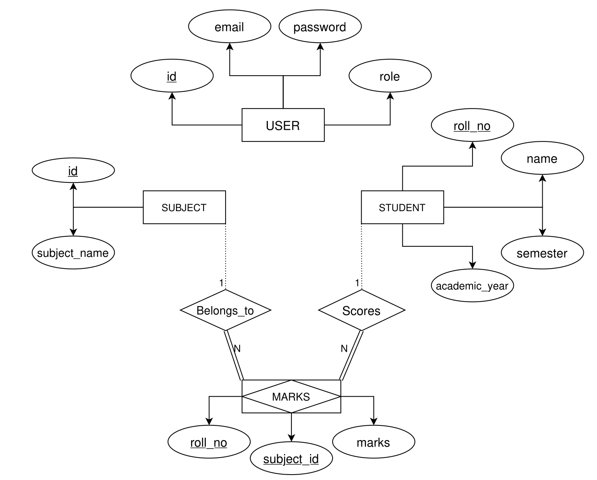
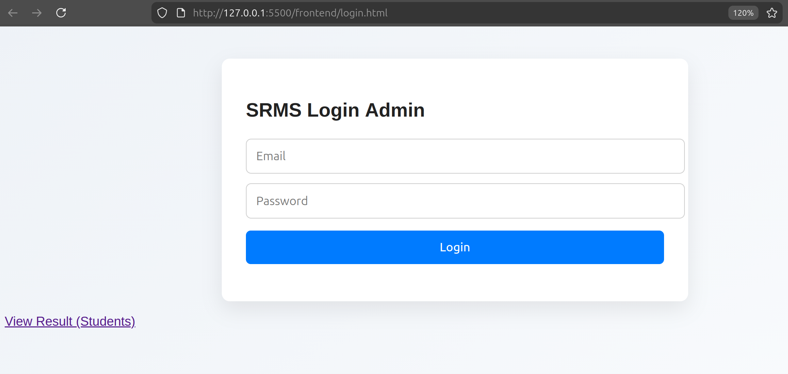
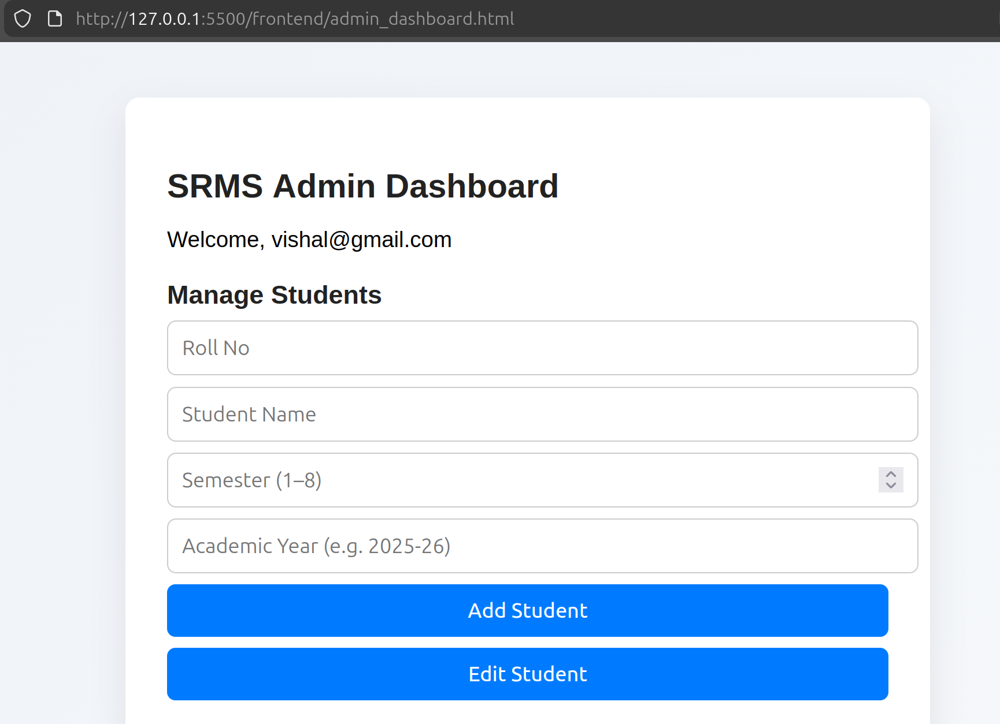
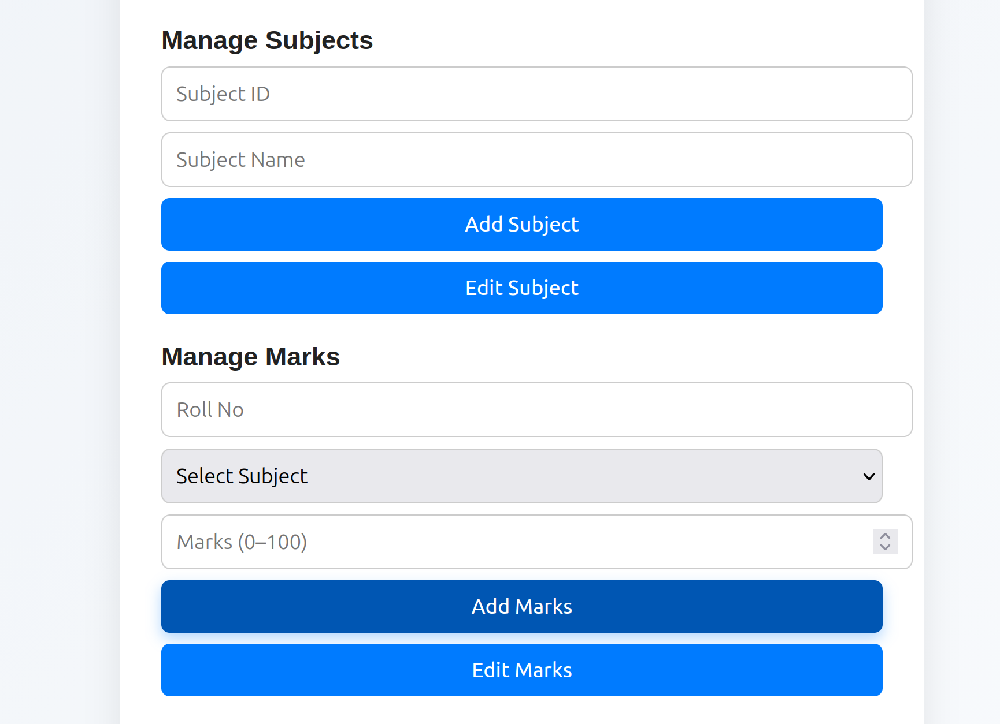
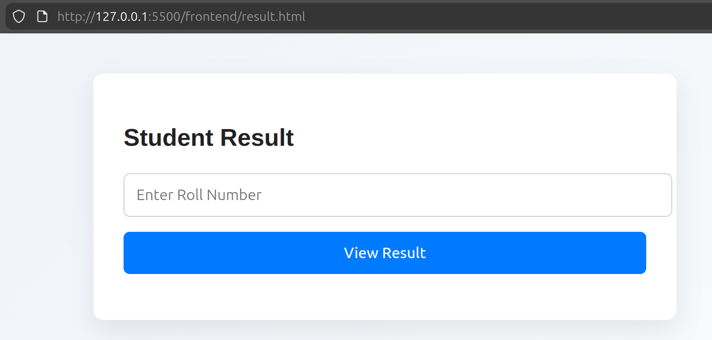
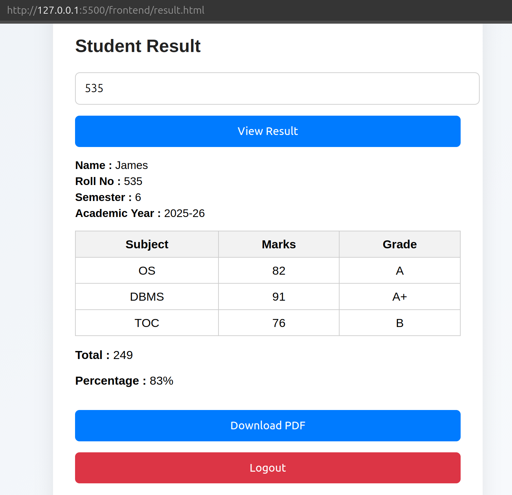
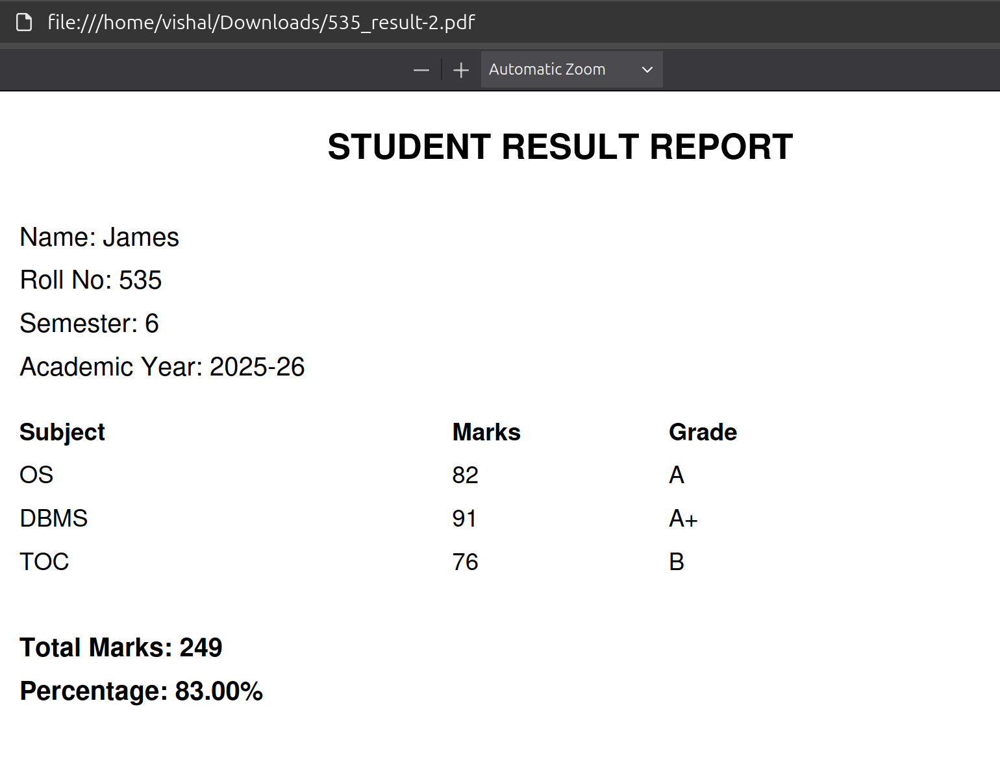

# 🎓 Student Result Management System (SRMS)

A full-stack Student Result Management System developed with Flask, MySQL, HTML, CSS, and JavaScript. The application provides an admin dashboard for managing student records, subjects, and marks, with RESTful APIs for backend operations, automated grade and percentage calculation, result retrieval by roll number, and PDF report generation.
---

## 🚀 Features

### Admin
- Admin login authentication
- Add and edit student information
- Add and edit subjects
- Add and edit student marks
- Subject selection using subject IDs
- Input validation and error handling

### Result Management
- Search results using student roll number
- Display student information
- Display subject-wise marks
- Automatic grade calculation
- Automatic total and percentage calculation
- Generate and download result PDF

### Backend
- REST APIs built with Flask
- MySQL database integration
- Environment-based database configuration
- CORS support

---

## 🛠️ Tech Stack

| Component | Technology |
|---|---|
| Backend | Python, Flask |
| Frontend | HTML, CSS, JavaScript |
| Database | MySQL |
| PDF Generation | ReportLab |
| Authentication | Flask-based login |
| Version Control | Git, GitHub |

---

## 🗂️ Database Design

The system uses the following main entities:

- **USER** – stores admin login information
- **STUDENT** – stores student information
- **SUBJECT** – stores subject information
- **MARKS** – associates students with subjects and stores marks

The **MARKS** table connects students and subjects and uses `(roll_no, subject_id)` as the identifying combination.

### ER Diagram



---

## 📂 Project Structure

```text
Student-Result-Management-System-SRMS/
│
├── app.py
├── frontend/
│   ├── login.html
│   ├── admin.html
│   ├── admin_dashboard.html
│   ├── result.html
│   └── css/
│       └── style.css
│
├── screenshots/
│   ├── er_diagram.png
│   ├── admin_login.png
│   ├── admin_dashboard1.png
│   ├── admin_dashboard2.png
│   ├── student_login.png
│   ├── result.png
│   └── result_pdf.png
│
├── .env.example
├── .gitignore
├── requirements.txt
├── README.md
└── LICENSE
```

 -.env and venv/ are intentionally excluded from GitHub.

---

## ⚙️ Setup Instructions

### 1️⃣ Clone the repository

```text
git clone https://github.com/vishal2313/Student-Result-Management-System-SRMS.git
cd Student-Result-Management-System-SRMS
```

### 2️⃣ Create a virtual environment
```text
python3 -m venv venv
source venv/bin/activate
```

### 3️⃣ Install dependencies
```text
pip install -r requirements.txt
```

### 4️⃣ Configure environment variables

Create a .env file in the project root:
```text
DB_USER=your_db_user
DB_PASSWORD=your_db_password
DB_HOST=127.0.0.1
DB_NAME=srms
DB_PORT=3306
```
Never commit your .env file. It is excluded through .gitignore.

### 5️⃣ Set up the MySQL database

Create a MySQL database named:
```text
CREATE DATABASE srms;
```
Create the required tables according to the database schema used by the application.

### 6️⃣ Run the application
```text
python app.py
```

Open the application in your browser:
```text 
http://127.0.0.1:5000
```
---
## 📸 Screenshots

### 🔐 Admin Login


### 🧑‍💼 Admin Dashboard



### 👨‍🎓 Student Login


### 📄 Student Result Page


### 🧾 Result PDF Generation


---
## 🔐 Security
- Database credentials are stored using environment variables.
- .env is excluded from version control.
- Virtual environment files are excluded from version control.
- API input validation is implemented for major operations.

This project is intended as an academic/project implementation and does not currently provide production-grade authentication or password hashing.

---
## 🔮 Future Improvements
- Password hashing
- JWT/session-based authentication
- Student login portal
- Student search and management tables
- Better role-based access control
- Cloud deployment
- Improved database schema and validation
- Responsive mobile interface

---
## 👤 Author

**Vishal Sonkar**

Bachelor of Technology (B.Tech)
Department of Computer Science and Engineering
National Institute of Technology Calicut

GitHub: https://github.com/vishal2313
